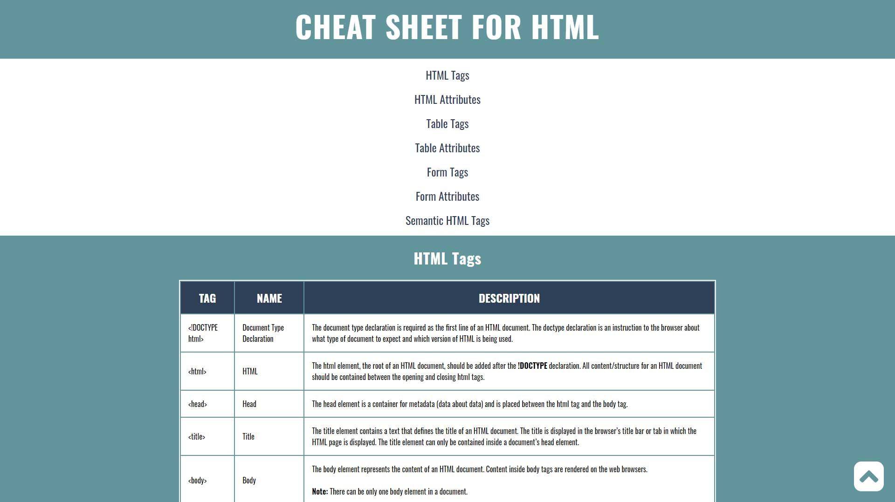

# Cheat Sheet for HTML
A reference sheet for HTML tags, attributes and their uses. Developed the website using table elements in HTML.

## Screenshot

## Visit
Click [here](https://yuj94.github.io/cheat-sheet-for-html/) to visit the website.

## Technologies
Project was built with:
- HTML
- CSS
- GitHub

## Status
Project is completed.